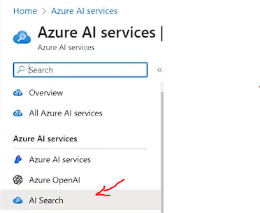
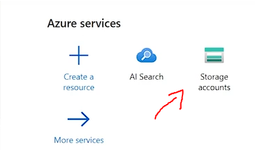
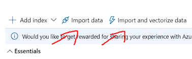

Este repositório documenta a utilização do **Azure Cognitive Search** com recursos de **AI Search** para indexar e consultar dados de forma inteligente voltado ao uso de Inteligência Artificial em aplicações reais de busca e análise de dados.
Passo a passo:

1. Criar um serviço de AI Search através do Azure AI Services:

2. Criar uma Storage Account (conta de armazenamento), onde iremos armazenar nossa fonte de dados a ser buscada:

3. Após alimentar a conta de armazenamento com os dados a serem buscados, basta importarmos a conexão na ferramenta de AI Search e ela automaticamente buscará pelo conteúdo a ser analisado:

São inúmeras as possibilidades de benefício na utilização de tal ferramente, tais como:

- Portais de Atendimento ao Cliente (Help Centers):

FAQs inteligentes com sugestões automáticas

Busca por artigos com entendimento de linguagem natural

Redução de chamados ao oferecer respostas automáticas relevantes

- Sistemas de Gestão de Conhecimento (Knowledge Base):

Empresas que possuem grandes volumes de documentos técnicos, normativos ou tutoriais

Facilidade de encontrar documentos e conteúdos relacionados por significado, e não só por palavras-chave

- Plataformas de E-commerce:
  
Busca de produtos com linguagem natural (ex: "camisa azul social manga longa")

Sugestões baseadas em contexto e histórico

Filtragem inteligente por categorias, faixas de preço, avaliações, etc.

- Dashboards e Ferramentas de BI:

Indexação de relatórios e arquivos com análise textual

Permite buscar relatórios com base em conteúdo, e não só título/data.

